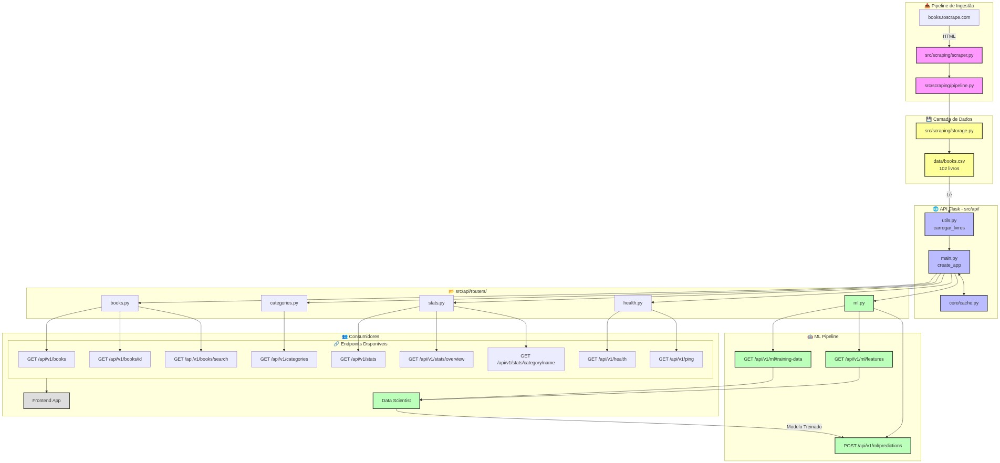

# API de Livros 

API RESTful para consulta de dados de livros extraídos do site [Books to Scrape](https://books.toscrape.com/).

## API em Produção

Base URL: https://api-livros-production-f911.up.railway.app/docs

| Endpoint | Descrição |
|----------|-----------|
| [/docs](https://api-livros-production-f911.up.railway.app/docs) | Documentação Swagger UI |
| [/api/v1/books](https://api-livros-production-f911.up.railway.app/api/v1/books) | Listar livros |
| [/api/v1/categories](https://api-livros-production-f911.up.railway.app/api/v1/categories) | Listar categorias |
| [/api/v1/stats](https://api-livros-production-f911.up.railway.app/api/v1/stats) | Estatísticas gerais |
| [/api/v1/health](https://api-livros-production-f911.up.railway.app/api/v1/health) | Status da API |

## Vídeo de Apresentação

[📺 **Clique aqui para assistir/baixar o vídeo (11 min)**](https://github.com/GabrielPeixer/api-livros/releases/tag/1.0.0)

## Descrição do Projeto

Este projeto implementa um sistema completo de extração e consulta de dados de livros, composto por:

1. Web Scraping: Script automatizado que extrai dados de livros do site Books to Scrape
2. Armazenamento: Dados salvos localmente em arquivo CSV
3. API REST: Endpoints para consulta de livros, categorias e estatísticas
4. Documentação: Swagger UI para explorar e testar a API

## Arquitetura do Projeto

```
api-livros/
├── src/
│   ├── api/              # Código da API Flask
│   │   ├── main.py       # Ponto de entrada e factory
│   │   ├── utils.py      # Funções auxiliares
│   │   ├── schemas.py    # Esquemas de dados
│   │   └── routers/      # Endpoints organizados por domínio
│   │       ├── books.py      # Rotas de livros
│   │       ├── categories.py # Rotas de categorias
│   │       ├── stats.py      # Rotas de estatísticas
│   │       └── health.py     # Rotas de saúde
│   ├── scraping/         # Código de web scraping
│   │   ├── scraper.py    # Extrator de dados
│   │   ├── pipeline.py   # Pipeline de execução
│   │   └── storage.py    # Persistência em CSV
│   └── core/             # Configurações centrais
│       ├── config.py     # Variáveis de ambiente
│       ├── cache.py      # Cache com Flask-Caching
│       ├── db.py         # Configuração do banco
│       └── logging_config.py  # Configuração de logs
├── data/
│   └── books.csv         # Dados extraídos
├── docs/
│   ├── index.html        # Swagger UI
│   ├── openapi.yaml      # Especificação OpenAPI
│   └── openapi.json      # Especificação em JSON
├── tests/                # Testes automatizados
├── requirements.txt      # Dependências
└── README.md
```

### Diagrama Arquitetural Completo



*Para versão SVG editável, veja [aqui](docs/arquitetura.svg)*

## Instalação e Configuração

### Pré-requisitos

- Python 3.8 ou superior
- Git

### 1. Clonar o Repositório

```bash
git clone https://github.com/GabrielPeixer/api-livros.git
cd api-livros
```

### 2. Criar Ambiente Virtual

Windows:
```bash
python -m venv venv
.\venv\Scripts\activate
```

Linux/macOS:
```bash
python3 -m venv venv
source venv/bin/activate
```

### 3. Instalar Dependências

```bash
pip install -r requirements.txt
```

### 4. Configurar Variáveis de Ambiente

Copie o arquivo `.env.example` para `.env`:

```bash
cp .env.example .env
```

Variáveis disponíveis:
```ini
API_HOST=0.0.0.0
API_PORT=5000
DEBUG=True
SITE_URL=https://books.toscrape.com/
```

## Execução

### 1. Coletar Dados (Web Scraping)

```bash
python src/scraping/scraper.py
```

Os dados serão salvos em `data/books.csv`.

### 2. Iniciar a API

```bash
python src/api/main.py
```

A API estará disponível em `http://localhost:5000`.

### 3. Acessar Documentação

Abra `http://localhost:5000/docs` para acessar o Swagger UI.

## Documentação da API

### Endpoints Core (v1)

| Método | Endpoint | Descrição |
|--------|----------|-----------|
| `GET` | `/api/v1/books` | Lista todos os livros disponíveis na base de dados |
| `GET` | `/api/v1/books/{id}` | Retorna detalhes completos de um livro específico pelo ID |
| `GET` | `/api/v1/books/search?title={title}&category={category}` | Busca livros por título e/ou categoria |
| `GET` | `/api/v1/categories` | Lista todas as categorias de livros disponíveis |
| `GET` | `/api/v1/health` | Verifica status da API e conectividade com os dados |

### Endpoints Adicionais

| Método | Endpoint | Descrição |
|--------|----------|-----------|
| `GET` | `/api/v1/stats` | Estatísticas gerais dos livros |
| `GET` | `/api/v1/stats/overview` | Visão geral: total, preço médio, distribuição de ratings |
| `GET` | `/api/v1/stats/category/{category}` | Estatísticas por categoria |
| `GET` | `/api/v1/ping` | Teste de conectividade |

### Pipeline ML-Ready

| Método | Endpoint | Descrição |
|--------|----------|-----------|
| `GET` | `/api/v1/ml/features` | Dados formatados como features para modelos ML |
| `GET` | `/api/v1/ml/training-data` | Dataset completo para treinamento de modelos |
| `POST` | `/api/v1/ml/predictions` | Receber predições de modelos externos |

---

### `GET /api/v1/books`

Lista todos os livros disponíveis na base de dados com paginação.

Parâmetros de Query:
| Parâmetro | Tipo | Padrão | Descrição |
|-----------|------|--------|-----------|
| `page` | integer | 1 | Número da página |
| `per_page` | integer | 20 | Itens por página |

Exemplo de Request:
```bash
curl "http://localhost:5000/api/v1/books?page=1&per_page=5"
```

Exemplo de Response (200 OK):
```json
{
  "estado": "sucesso",
  "dados": [
    {
      "id": 1,
      "title": "A Light in the Attic",
      "price": 51.77,
      "availability": "In stock",
      "rating": 3,
      "category": "Poetry"
    },
    {
      "id": 2,
      "title": "Tipping the Velvet",
      "price": 53.74,
      "availability": "In stock",
      "rating": 1,
      "category": "Historical Fiction"
    }
  ],
  "meta": {
    "pagina": 1,
    "por_pagina": 5,
    "total_itens": 100,
    "total_paginas": 20
  }
}
```

---

### `GET /api/v1/books/{id}`

Retorna detalhes completos de um livro específico pelo ID.

Parâmetros de Path:
| Parâmetro | Tipo | Descrição |
|-----------|------|-----------|
| `id` | integer | ID do livro (1-indexed) |

Exemplo de Request:
```bash
curl "http://localhost:5000/api/v1/books/1"
```

Exemplo de Response (200 OK):
```json
{
  "estado": "sucesso",
  "dados": {
    "id": 1,
    "title": "A Light in the Attic",
    "price": 51.77,
    "availability": "In stock",
    "rating": 3,
    "category": "Poetry"
  }
}
```

Exemplo de Response (404 Not Found):
```json
{
  "estado": "erro",
  "mensagem": "Livro não encontrado"
}
```

---

### `GET /api/v1/books/search`

Busca livros por título e/ou categoria.

Parâmetros de Query:
| Parâmetro | Tipo | Obrigatório | Descrição |
|-----------|------|-------------|-----------|
| `title` | string | Não | Título ou parte do título |
| `category` | string | Não | Categoria ou parte da categoria |

Exemplo de Request:
```bash
curl "http://localhost:5000/api/v1/books/search?title=Light&category=Poetry"
```

Exemplo de Response (200 OK):
```json
{
  "estado": "sucesso",
  "dados": [
    {
      "title": "A Light in the Attic",
      "price": 51.77,
      "availability": "In stock",
      "rating": 3,
      "category": "Poetry"
    }
  ],
  "meta": {
    "total_resultados": 1
  }
}
```

---

### `GET /api/v1/categories`

Lista todas as categorias de livros disponíveis.

Exemplo de Request:
```bash
curl "http://localhost:5000/api/v1/categories"
```

Exemplo de Response (200 OK):
```json
{
  "estado": "sucesso",
  "dados": [
    "Travel",
    "Mystery",
    "Historical Fiction",
    "Sequential Art",
    "Classics",
    "Philosophy",
    "Romance",
    "Poetry"
  ]
}
```

---

### `GET /api/v1/health`

Verifica status da API e conectividade com os dados.

Exemplo de Request:
```bash
curl "http://localhost:5000/api/v1/health"
```

Exemplo de Response (200 OK):
```json
{
  "estado": "sucesso",
  "dados": {
    "servico": "api-livros",
    "versao": "v1",
    "estado": "operacional",
    "dados": {
      "arquivo_existe": true,
      "status": "ok",
      "total_registros": 100
    }
  }
}
```

---

### `GET /api/v1/stats`

Retorna estatísticas gerais sobre todos os livros.

Exemplo de Request:
```bash
curl "http://localhost:5000/api/v1/stats"
```

Exemplo de Response (200 OK):
```json
{
  "estado": "sucesso",
  "dados": {
    "total_livros": 100,
    "preco_medio": 35.07,
    "preco_minimo": 10.00,
    "preco_maximo": 59.99
  }
}
```

---

### `GET /api/v1/stats/overview`

Retorna uma visão geral completa com distribuição de ratings por estrelas.

Exemplo de Request:
```bash
curl "http://localhost:5000/api/v1/stats/overview"
```

Exemplo de Response (200 OK):
```json
{
  "estado": "sucesso",
  "dados": {
    "total_livros": 100,
    "preco_medio": 35.07,
    "preco_minimo": 10.00,
    "preco_maximo": 59.99,
    "total_categorias": 50,
    "distribuicao_ratings": {
      "1_estrela": 0,
      "2_estrelas": 50,
      "3_estrelas": 15,
      "4_estrelas": 20,
      "5_estrelas": 15
    }
  }
}
```

---

### `GET /api/v1/stats/category/{category}`

Retorna estatísticas de uma categoria específica.

Parâmetros de Path:
| Parâmetro | Tipo | Descrição |
|-----------|------|-----------|
| `category` | string | Nome da categoria |

Exemplo de Request:
```bash
curl "http://localhost:5000/api/v1/stats/category/Travel"
```

Exemplo de Response (200 OK):
```json
{
  "estado": "sucesso",
  "dados": {
    "total_livros": 11,
    "preco_medio": 42.50,
    "preco_minimo": 15.00,
    "preco_maximo": 55.00,
    "categoria": "Travel"
  }
}
```

---

## 🤖 Pipeline ML-Ready

Endpoints otimizados para integração com modelos de Machine Learning.

### `GET /api/v1/ml/features`

Retorna dados dos livros formatados como features para modelos ML.

**Parâmetros de Query:**
| Parâmetro | Tipo | Padrão | Descrição |
|-----------|------|--------|-----------|
| `limit` | integer | - | Número máximo de registros |
| `offset` | integer | 0 | Pular N primeiros registros |

**Exemplo de Request:**
```bash
curl "http://localhost:5000/api/v1/ml/features?limit=2"
```

**Exemplo de Response (200 OK):**
```json
{
  "estado": "sucesso",
  "dados": {
    "total_registros": 100,
    "registros_retornados": 2,
    "offset": 0,
    "limit": 2,
    "features": [
      {
        "id": 1,
        "titulo": "A Light in the Attic",
        "categoria": "Poetry",
        "preco": 51.77,
        "rating_numerico": 3,
        "rating_normalizado": 0.6,
        "em_estoque": true,
        "quantidade_estoque": 22,
        "titulo_tamanho": 20,
        "categoria_encoded": 456
      }
    ]
  }
}
```

---

### `GET /api/v1/ml/training-data`

Retorna dataset formatado para treinamento de modelos ML.

**Parâmetros de Query:**
| Parâmetro | Tipo | Padrão | Descrição |
|-----------|------|--------|-----------|
| `format` | string | json | Formato do output (json, array) |
| `target` | string | rating | Campo alvo (rating, price) |

**Exemplo de Request:**
```bash
curl "http://localhost:5000/api/v1/ml/training-data?target=rating"
```

**Exemplo de Response (200 OK):**
```json
{
  "estado": "sucesso",
  "dados": {
    "feature_names": ["preco", "rating_numerico", "quantidade_estoque", "titulo_tamanho", "categoria_encoded"],
    "features": [
      [51.77, 3, 22, 20, 456],
      [53.74, 1, 20, 24, 789]
    ],
    "labels": [3, 1],
    "num_samples": 100,
    "num_features": 5,
    "target_name": "rating",
    "task_type": "classification"
  }
}
```

---

### `POST /api/v1/ml/predictions`

Recebe predições de modelos ML externos.

**Body (JSON):**
| Campo | Tipo | Obrigatório | Descrição |
|-------|------|-------------|-----------|
| `model_name` | string | ✅ | Nome do modelo |
| `model_version` | string | ❌ | Versão do modelo (padrão: 1.0.0) |
| `predictions` | array | ✅ | Lista de predições |
| `metadata` | object | ❌ | Metadados adicionais |

**Exemplo de Request:**
```bash
curl -X POST "http://localhost:5000/api/v1/ml/predictions" \
  -H "Content-Type: application/json" \
  -d '{
    "model_name": "book_rating_classifier",
    "model_version": "1.0.0",
    "predictions": [
      {"book_id": 1, "predicted_rating": 4, "confidence": 0.85},
      {"book_id": 2, "predicted_rating": 3, "confidence": 0.72}
    ],
    "metadata": {"training_date": "2024-01-15", "accuracy": 0.89}
  }'
```

**Exemplo de Response (200 OK):**
```json
{
  "estado": "sucesso",
  "dados": {
    "mensagem": "Predições recebidas com sucesso",
    "model_name": "book_rating_classifier",
    "model_version": "1.0.0",
    "predictions_count": 2,
    "metadata_received": true,
    "status": "processed"
  }
}
```

---

## Exemplos de Uso com Python

### Listar Livros

```python
import requests

response = requests.get('http://localhost:5000/api/v1/books', params={
    'page': 1,
    'per_page': 10
})

data = response.json()
print(f"Total de livros: {data['meta']['total_itens']}")

for livro in data['dados']:
    print(f"- {livro['title']} (£{livro['price']})")
```

### Buscar Livro por ID

```python
import requests

book_id = 1
response = requests.get(f'http://localhost:5000/api/v1/books/{book_id}')

if response.status_code == 200:
    livro = response.json()['dados']
    print(f"Título: {livro['title']}")
    print(f"Preço: £{livro['price']}")
    print(f"Avaliação: {livro['rating']} estrelas")
else:
    print("Livro não encontrado")
```

### Buscar Livros por Título e Categoria

```python
import requests

response = requests.get('http://localhost:5000/api/v1/books/search', params={
    'title': 'Light',
    'category': 'Poetry'
})

data = response.json()
print(f"Encontrados: {data['meta']['total_resultados']} livros")

for livro in data['dados']:
    print(f"- {livro['title']} ({livro['category']})")
```

### Listar Categorias

```python
import requests

response = requests.get('http://localhost:5000/api/v1/categories')
categorias = response.json()['dados']

print("Categorias disponíveis:")
for cat in categorias:
    print(f"  - {cat}")
```

### Verificar Saúde da API

```python
import requests

response = requests.get('http://localhost:5000/api/v1/health')
health = response.json()['dados']

print(f"Serviço: {health['servico']}")
print(f"Versão: {health['versao']}")
print(f"Estado: {health['estado']}")
print(f"Total de registros: {health['dados']['total_registros']}")
```

## Testes

### Executar Testes

```bash
pytest tests/
```

### Verificar Estilo de Código

```bash
flake8 src tests
```

## Deploy

### Deploy com Docker

Este projeto inclui um `Dockerfile` otimizado para production. A aplicação é containerizada e pronta para deploy em plataformas cloud.

#### Variáveis de Ambiente para Production

```ini
FLASK_ENV=production
DEBUG=False
API_HOST=0.0.0.0
API_PORT=5000
```

#### Build Local (Teste)

```bash
# Build da imagem
docker build -t api-livros:latest .

# Executar container
docker run -p 5000:5000 \
  -e FLASK_ENV=production \
  -e DEBUG=False \
  api-livros:latest
```

A API estará disponível em `http://localhost:5000/docs`

### Deploy no Railway 

O Railway detecta automaticamente o `Dockerfile` no repositório e faz deploy com mínima configuração.

#### Pré-requisitos

- Repositório GitHub com o projeto
- Conta no [railway.app](https://railway.app)

#### Passos para Deploy

1. Acesse o Railway
   - Vá para [railway.app](https://railway.app)
   - Faça login com sua conta GitHub

2. Crie um Novo Projeto
   - Clique em **"New Project"**
   - Selecione **"Deploy from GitHub repo"**
   - Conecte seu repositório `GabrielPeixer/api-livros`

3. Railway Detectará Automaticamente
   - O Railway vai identificar o `Dockerfile`
   - Vai fazer build da imagem
   - Vai fazer deploy do container

4. Configurar Variáveis de Ambiente (Opcional)
   - Na aba **"Variables"** do projeto
   - Adicione as variáveis necessárias:
     ```
     FLASK_ENV=production
     DEBUG=False
     API_PORT=5000
     ```

5. Deploy Completo
   - O Railway automaticamente atribui um domínio público
   - A URL fica no formato: `https://api-livros-production-xxxx.railway.app`
   - Acesse `/docs` para a documentação Swagger

#### Redeploy Automático

Cada push para o branch `main` dispara um novo deploy automaticamente.

#### Monitorar Logs

No dashboard do Railway, você pode ver logs em tempo real do container em execução.

---

### Alternativa: Produção com Waitress (Windows)

```bash
pip install waitress
waitress-serve --port=5000 --call src.api.main:create_app
```

### Alternativa: Produção com Gunicorn (Linux)

```bash
pip install gunicorn
gunicorn -w 4 -b 0.0.0.0:5000 "src.api.main:create_app()"
```

## Notas

- O scraping é limitado a 5 páginas por padrão (configurável no código)
- Os dados são salvos em `data/books.csv`
- A API roda na porta 5000 por padrão
- Cache de 5 minutos (300 segundos) em endpoints de listagem
- Todos os endpoints usam o prefixo `/api/v1/`
- **Docker**: Imagem otimizada incluindo base Python 3.11-slim
- **Railway**: Deploy automático com detecção de Dockerfile
- **Produção**: FLASK_ENV=production e DEBUG=False ativado automaticamente em container

## Licença

Este projeto está licenciado sob a licença MIT.
